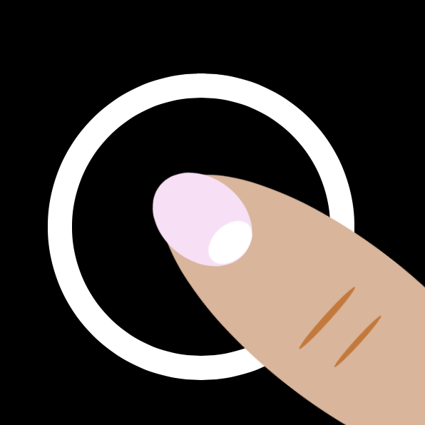

 
# 3 Seconds Tap 

Apple Watch Game ⌚️

Current version supports only Iphone SE paired with Apple Watch Series 4 40mm

## Phases
 
  
  
  

## Getting Started

To execute it and run it in your device:
  
  1.Clone the repository in your machine.
  
  2.Look for the 3sTap.xcodeproj file, and open it
  
  3.Once you have opened the entire project. Go to simulators, and select the option to simulate an Iphone SE + Apple Watch Series 4 40mm
  
  4.Click ▶️
  
  5.Enjoy the game 😊
  
### Prerequisites

  Having XCode 9 or above Installed is Unexpendable
  
## Authors

* **Cristian Kublai Gómez López** - *Initial work* - [criskgl](https://github.com/criskgl)

## License

This project is licensed under the MIT License - see the [LICENSE.md](LICENSE.md) file for details

## Acknowledgments

* Thanks to the World Wide Web.
